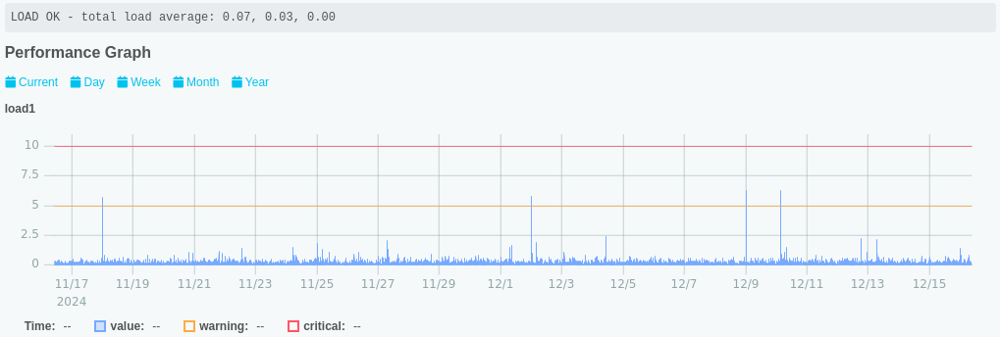
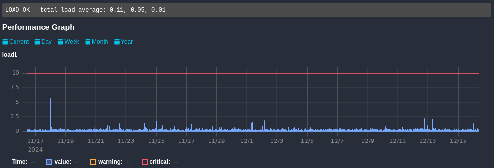

# Icinga Web Performance Data Graphs

Icinga Web Module for Performance Data Graphs. This module enables graphs on the Host and Service Detail View for
the respective performance data.

The data is fetched by a "backend module", at least one backend module also need to be enabled.

This module aims to be a "batteries included" and opinionated solution.
Configuration options are limited by design.

## Features

* Interactive graphs for Host and Service performance data
  * Mouse click and select a region to zoom in
  * Click on a time range or double click to zoom out
* Graphs are adjustable via Icinga 2 custom variables
* Interchangeable performance data backends
  * Fetched data is cached to improve speed and reduce load on the backend

## Installation Requirements

* PHP version ≥ 8.0
* IcingaDB or IDO Database

## Documentation

Documentation for this module is available at [doc](doc/).

# Known Issues

### Inconsistent collapsible behavior during autorefresh

When there are mulitple graphs on the page
the autorefresh can sometimes cause inconsistent collapsible behavior.

# Road to Version 1.0.0

What our current idea for a version 1.0.0 of this module is:

* It should work with every Icinga performance data writer with minimal configuration by the user
* It should be a robust solution for all check plugins
* It should integrate seamlessly in the Icinga Web UI, without degrading performance
  (e.g. when a plugin lots of data)
* It should provide enough options for customization for most use cases
