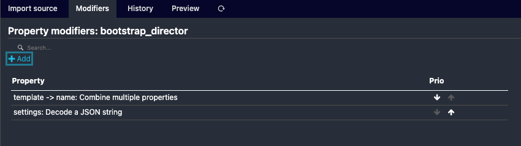
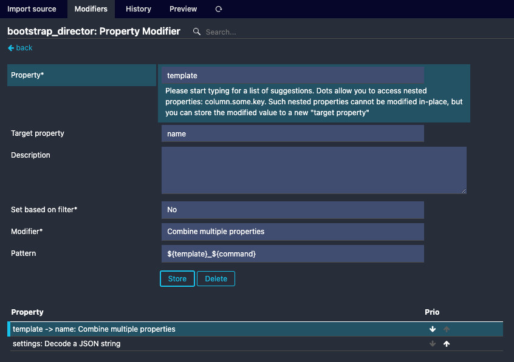
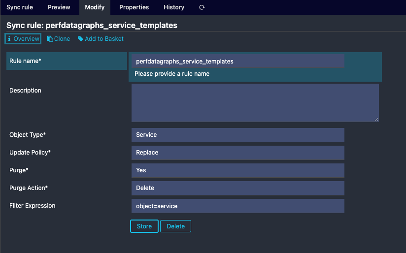
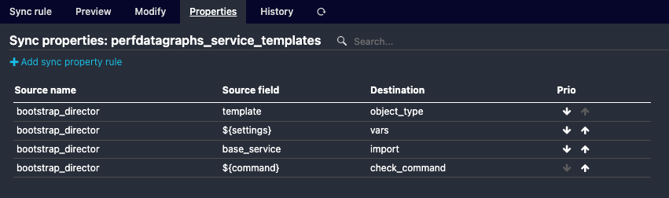
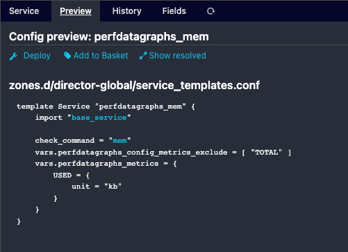
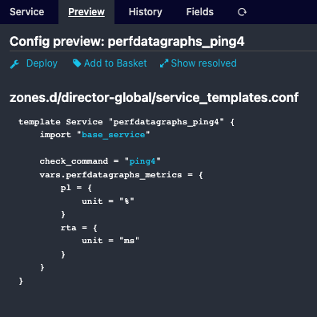

# Configuration

## Backend Configuration

A "backend module", which is responsible for fetching the data from a performance data backend (Graphite, OpenSearch, Elasticsearch, InfluxDB, etc.), can be configured:

1. Install the Icinga Web Performance Data Graphs backend module you need (depending on where Icinga2 sends its data)
2. If you only install one backend module, you do not need to configure it
3. If there is more than one, configure the backend using the `Configuration → Modules → Performance Data Graphs → General` menu

## Custom Variables

Icinga 2 Custom Variables can be used to modify the rendering of graphs.

The custom variables `perfdatagraphs_metrics (dictionary)` is used to modify a specific graph:

- `unit`, unit of this metric that should be displayed
- `fill`, color of the inside of the graph
- `stroke` color of the line of the graph

The variable `perfdatagraphs_metrics` is a dictionary, its keys are the name of the metric
you want to modify. Examples:

```
apply Service "apt" {
  // Set or override a unit for a metric
  vars.perfdatagraphs_metrics["available_upgrades"] = {
    unit = "packages"
  }

  // Set specific colors for a metric
  vars.perfdatagraphs_metrics["critical_updates"] = {
    unit = "packages"
    fill = "rgba(255, 0, 30, 0.3)"
    stroke = "rgba(255, 0, 30, 1)"
  }
}
```

The custom variable `perfdatagraphs_config_disable (bool)` is used to disable a specific graph.

```
apply Service "icinga" {
  vars.perfdatagraphs_config_disable = true
}
```

The custom variable `perfdatagraphs_config_backend (string)` is used to set a specific backend for an object.
If the backend is not available no data will be returned.

```
apply Service "users" {
  vars.perfdatagraphs_config_backend = "MyCustomGraphiteBackend"
}
```

The custom variable `perfdatagraphs_config_metrics_include (array[string])` is used to select specific metrics that
should be rendered, if not set all metrics are rendered. Wildcards can be used with: `*`.

The custom variable `perfdatagraphs_config_metrics_exclude (array[string])` is used to exclude a metric.
This takes precedence over the include.

Examples:

```
apply Service "icinga" {
  vars.perfdatagraphs_config_metrics_include = ["uptime", "*_latency"]
  vars.perfdatagraphs_config_metrics_exclude = ["avg_latency"]
}
```

### Director Integration

Custom variables as dictionaries aren't available as in the DSL, thus to provide customvars for specific graphs you need to use the Director automation. 

We assume graph customization isn't done regularly, thus we use the Director's automation process.

#### CSV Import

To proceed have the Fileshipper Module installed and configured. [Fileshipper](https://github.com/Icinga/icingaweb2-module-fileshipper)

Please add a CSV file to your imports path with the following values. You can tweak and add dictionaries in the settings column. 

```
object;template;command;settings
service;perfdatagraphs;icingadb;{}
service;perfdatagraphs;cluster-zone;{}
service;perfdatagraphs;cluster;{}
service;perfdatagraphs;icinga;{"perfdatagraphs_config_metrics_exclude":["uptime","num_hosts*","num_services*"]}
service;perfdatagraphs;mem;{"perfdatagraphs_config_metrics_exclude":["TOTAL"],"perfdatagraphs_metrics":{"USED":{"unit":"kb"}}}
service;perfdatagraphs;ping4;{"perfdatagraphs_metrics":{"pl":{"unit":"%"},"rta":{"unit":"ms"}}}
service;perfdatagraphs;ping6;{"perfdatagraphs_metrics":{"pl":{"unit":"%"},"rta":{"unit":"ms"}}}
host;perfdatagraphs;hostalive;{"perfdatagraphs_metrics":{"pl":{"unit":"%"},"rta":{"unit":"ms"}}}
```

#### Import

Add an import and import the created CSV file. And add two modifiers, one to decode the settings to a JSON and a second to combine the template with a command, which will be the name of the template.





#### Sync

Afterwards you can add a sync rule which creates service templates with the dictionaries provided by the CSV. 





#### Templates

After the sync observe the dictionaries visible in the preview section. You cannot edit the dictionaries in the templates but in the CSV. 




